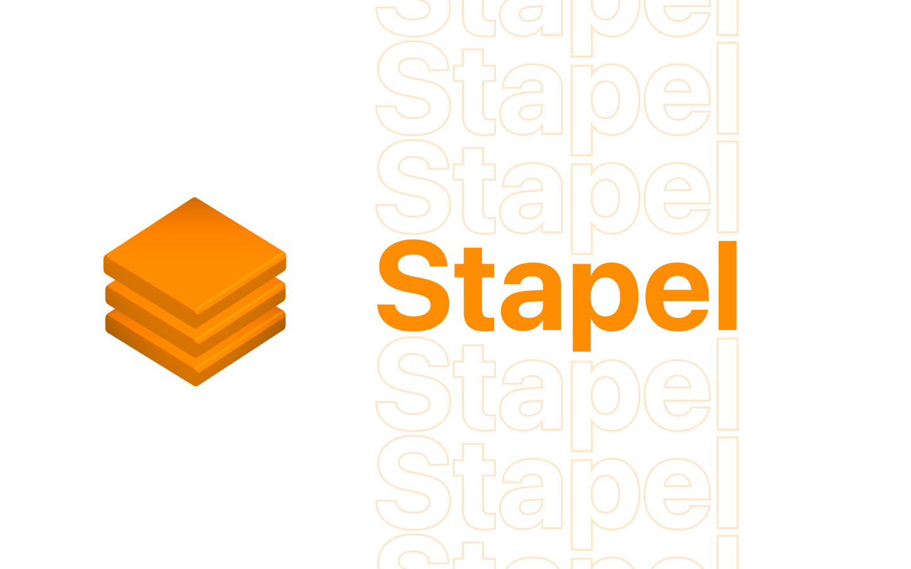

<div align="center">
    
</div>

# Stapel

A native stack navigation library for SwiftUI enabling programmatic and interactive navigation, using only NavigationLinks.

> 👉 Check out the accompanying [release post](https://brunoscheufler.com/blog/2020-12-30-introducing-stapel)

## Installation

Stapel is compatible with SwiftUI projects building for `iOS 14` and newer.

You can install Stapel via Swift Package Manager. In Xcode, go to `File > Swift Packages > Add Package Dependency...`, and follow the instructions.

### Why Stapel?

Existing navigation libraries diverge from the navigation experience offered in native SwiftUI, which is understandable given the behaviour
most people are used to from NavigationLinks and managing nested navigation.

This difference, however, often means that libraries won't use regular NavigationLinks, so trivial features like back buttons, or using common modifiers for toolbars
won't work the same way as you'd expect.

Stapel tries to create a simple layer of abstraction managing a virtual stack containing views to be rendered in a nested fashion.
It does this by using so-called pusher views which register themselves when they appear for the first time, creating a virtual view hierarchy.
This is then used to determine where to push a new view. At the moment, it will be rendered for the view that is on top, or rather for
the pusher that was registered most recently.

### Why is Stapel not available for macOS?

As we have to use [StackNavigationStyle](https://developer.apple.com/documentation/swiftui/stacknavigationviewstyle) to be able to properly handle stack navigation,
it's a hard requirement for Stapel to work. Unfortunately, as of now, StackNavigationStyle is not available for macOS.

## Usage

### Setting up Stapel

Stapel exposes a Stack class that can be instantiated as StateObject, allowing SwiftUI to manage its state.
Once configured, you can pass the stack down as an environment object.

In your root view, simply use `WithStapel`, which initializes a navigation view and set the stack environment object.

```swift
import SwiftUI
import Stapel

struct ContentView: View {
    @StateObject var stack = Stack()

    var body: some View {
        WithStapel {
            Text("Root View")
        }
        // Pass down the stack to access it anywhere, this is required!
        .environmentObject(stack)
    }
}
```

Once the basic setup is done, you can set wrap views which should allow navigation pushes with a pusher as follows

```swift
import SwiftUI
import Stapel

struct ContentView: View {
    @StateObject var stack = Stack()

    var body: some View {
        WithStapel {
            StackNavigationLink(label: {
                Text("Push another view")
            }) {
                Text("Hello world!")
            }
        }
        // Pass down the stack to access it anywhere, this is required!
        .environmentObject(stack)
    }
}
```


After adding `WithStapel` to your view tree, it will automatically register a root pusher using the stack passed down as an environment object
and render pushed views assigned to it from now on. You need to add a pusher to every subsequent layer of your navigation, if you
only add it to the root view, it will simply re-render the currently pushed view if you push again.

Internally, Stapel will evaluate the list of registered pusher views and attach the view to be pushed to the pusher that is associated
with the view "on top". This results in a natural stack navigation behaviour, where new views are pushed on top.

As Stapel utilizes only native NavigationLink views under the hood, you get the benefits of having a working back button, which also
allows users to pop to root, without any further configuration. You can also customize the navigation as you would do in any other app, Stapel
is merely concerned with managing your stack and deciding where a pushed view should be rendered.

### Link-based navigation

As you might have seen in the previous example, Stapel offers a low-overhead alternative to the classic
NavigationLink, rendering a Button with a given label and wiring up the pushing logic internally, to push the given
view onto the stack once a user taps on the button.

```swift
StackNavigationLink(label: {
    Text("Push another view")
}) {
    Text("Hello world!")
}
```

This is kept intentionally simple for now, but might be extended with state management functionality to trigger
a navigation link to push when a condition evaluates to true, similar to `isActive` for regular NavigationLinks. For these
types of actions, you should use programmatic navigation, though.

When you want to embed navigation links in a list, you might use `ListNavigationLink`, which renders some additional styles
like a right-facing arrow.

```swift
ListNavigationLink(label: {
    Text("Push another view")
}) {
    Text("Hello world!")
}
```

### Programmatic navigation

```swift
Button {
    stack.push(
        view: AnyView(
            Text("Programmatically pushed!")
        )
    )
} label: {
    Text("Tap this button to push")
}
```

This is almost a one-to-one implementation of the StackNavigationLink, which you can customize even further.
Using `stack.push`, you can push any view to the stack, whether you are in the root or leaf node of the view hierarchy.
Just push your view, and Stapel will make sure it's rendered where it should be.

### Multiple layers (nested navigation)

Stapel handles any level of nested views just fine, don't forget to add a pusher to each level though, if you want proper
rendering of pushed views instead of resets of the current view.

```swift
import SwiftUI
import Stapel

struct ContentView: View {
    @StateObject var stack = Stack()

    var body: some View {
        WithStapel {
            Text("Root View")
            StackNavigationLink(label: {
                Text("Push another view")
            }) {
                WithPusher {
                    Text("Second view")
                    StackNavigationLink(label: {
                        Text("Push yet another view")
                    }) {
                        WithPusher {
                            Text("Third view")
                            StackNavigationLink(label: {
                                Text("And another view")
                            }) {
                                WithPusher {
                                    Text("Fourth view")
                                }
                            }
                        }
                    }
                }
            }
        }
        .environmentObject(stack)
    }
}
```


As you can see, you can go on and on (please split out your sub-views though).

### Push evaluation

In specific cases, you might like to prevent pushes to the active pusher. If the view that you'd push is equal to the current view, for example, it wouldn't make
much sense to push it to the stack again. Especially for programmatic navigation, it can be helpful to add a condition when a push should happen and to be able
to check if a push would succeed. This is why Stapel offers Push evaluation for each registered pusher.

Setting up push evaluation requires two steps: Adding an evaluation function to the pusher that you'd like to control, and supplying context when pushing.

#### Adding an evaluation function

During each push, we check whether an evaluation function was set for the pusher that would receive the view to be pushed.
If no function exists, the push will _always_ be allowed.
If an evaluation function is set, we will invoke it and pass the supplied context.
If the evaluation function returns `true`, we'll push the view onto the stack, otherwise, it'll be a no-op.

Let's see how we'd register an evaluation function on our root level. If this evaluates to false, we won't onto that.

```swift
struct ContentView: View {
    @StateObject var stack = Stack()
    
    var body: some View {
        WithStapel({ (context) -> Bool in
            guard let hasExpected = context["expected"] else {
                return false
            }
            guard let isString = hasExpected as? String else {
                return false
            }
            return isString == "value"
        }) {
            Text("Root view")
            Button(action: {
                stack.push(view: AnyView(Text("No-op")))
            }, label: {
                Text("Push falsy")
            })
            Button(action: {
                stack.push(view: AnyView(Text("Pushed with evaluation")), context: ["expected" : "value"])
            }, label: {
                Text("Push truthy")
            })
        }
        .environmentObject(stack)
    }
}
```

This will render two buttons on the root level, one that will supply the expected context and result in a push, and
another one that will not push, as it doesn't supply a context (or an invalid context).

While this only affects the initial layer, we might also want to control subsequent layers. This can be done by supplying an evaluation
function to `WithPusher`.

```swift
struct ContentView: View {
    @StateObject var stack = Stack()
    var body: some View {
        // Initial layer, will always push
        WithStapel {
            VStack {
                Text("Root View").navigationBarTitle("Root view")
                StackNavigationLink(label: {
                    Text("Push another view")
                }) {
                    
                    // Second layer, only push further view if evaluation succeeds
                    WithPusher({ (context) -> Bool in
                        guard let hasExpected = context["expected"] else {
                            return false
                        }
                        guard let isString = hasExpected as? String else {
                            return false
                        }
                        return isString == "value"
                    }) {
                        Text("Second view").navigationBarTitle("Second view")
                        Button(action: {
                            stack.push(view: AnyView(Text("No-op")))
                        }, label: {
                            Text("Push falsy")
                        })
                        Button(action: {
                            stack.push(view: AnyView(Text("Pushed with evaluation")), context: ["expected" : "value"])
                        }, label: {
                            Text("Push truthy")
                        })
                    }
                    
                }
            }
        }
        .environmentObject(stack)
    }
}
```

#### Supplying context on push

Now that we set up an evaluation function, we can supply relevant context information when pushing programmatically.

```swift
stack.push(view: AnyView(Text("Pushed with evaluation")), context: ["expected" : "value"])
```

As you can see, context is a simple dictionary with string keys and arbitrary values. These values will be passed to our evaluation
function and result in a push if it returns true.

You don't have to call push to find out if a view _would_ be pushed though, for this purpose you can use `stack.evaluate`. Similar to `stack.push`, it accepts
an optional context dictionary, and will run the evaluation logic. Internally, we use `stack.evaluate` when pushing, so the results will match.

```swift
stack.evaluate(["expected" : "value"])
```

If you don't pass a context dictionary to `stack.push` or `stack.evaluate`, we'll pass an empty dictionary instead. Thus the pusher evaluation function always receives
a dictionary and always returns a boolean value.
